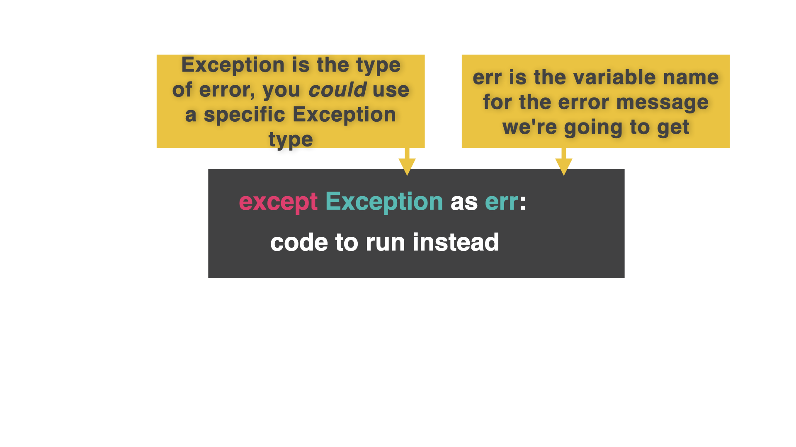

# Avoiding Crashes

Sometimes, we just can't code around a crash. It's coming anyway, and all you can do is brace for impact.

Until now!

Let's look at an example based on yesterday's lesson.
##

👉 In this example, if the 'Stuff.mine' file doesn't exist, then the code will throw a 'no such file' error.

```python
myStuff = []

f.open("Stuff.mine","r")
myStuff = eval(f.read())
f.close()

for row in myStuff:
  print(row)
```
## Try...except
The new construct to get around this is called `try.... except`

All the code that *should* work goes inside the `try`.


The error messages/instructions to handle any errors running the `try` code go inside the `except`.


👉 Like this:

```python
myStuff = []

try:
  f.open("Stuff.mine","r")
  myStuff = eval(f.read())
  f.close()
# Try to find a file called 'Stuff.mine' and open it

except:
  print("ERROR: Unable to load")
# If the file can't be found, show the error instead of crashing the whole program
  

for row in myStuff:
  print(row)
```

## You are a Software Developer!

`try.... except` is great for improving the user experience to reduce frustration.

However, there are problems with just putting the **whole code** in a 'try except'.

As developers (yes you are a software developer now), it'd be nice to know what sort of error has occurred so that we have a better idea of how to fix it.


We can tell `except` what type of error(s) to look for.  `Exception` (capital 'E') means 'every type'. I've captured the error type in the 'err' variable and printed it out to tell me what the error is.
[Here's a list](https://www.w3schools.com/python/python_ref_exceptions.asp) of some built in `except` error codes.



👉 Look at how I've extended the `except` now.
```python
myStuff = []

try:
  f.open("Stuff.mine","r")
  myStuff = eval(f.read())
  f.close()
# Try to find a file called 'Stuff.mine' and open it

except Exception as err:
  print("ERROR: Unable to load")
  print(err)
  

for row in myStuff:
  print(row)
```

## Traceback

We could even get rid of the 'err' variable entirely and print a traceback, which will show you the red error tracing you see when python crashes.

I've created a 'debugMode' variable at the top of my code and pu the traceback in an `if` inside the `except`.  

👉 This lets me show/hide the tracebacks easily by setting `debugMode` to True/False:

```python
debugMode = True
myStuff = []

try:
  f.open("Stuff.mine","r")
  myStuff = eval(f.read())
  f.close()
# Try to find a file called 'Stuff.mine' and open it

except Exception:
  print("ERROR: Unable to load")

  if debugMode:
    print(traceback)

for row in myStuff:
  print(row)
```


### Try it out and see what errors you can catch!